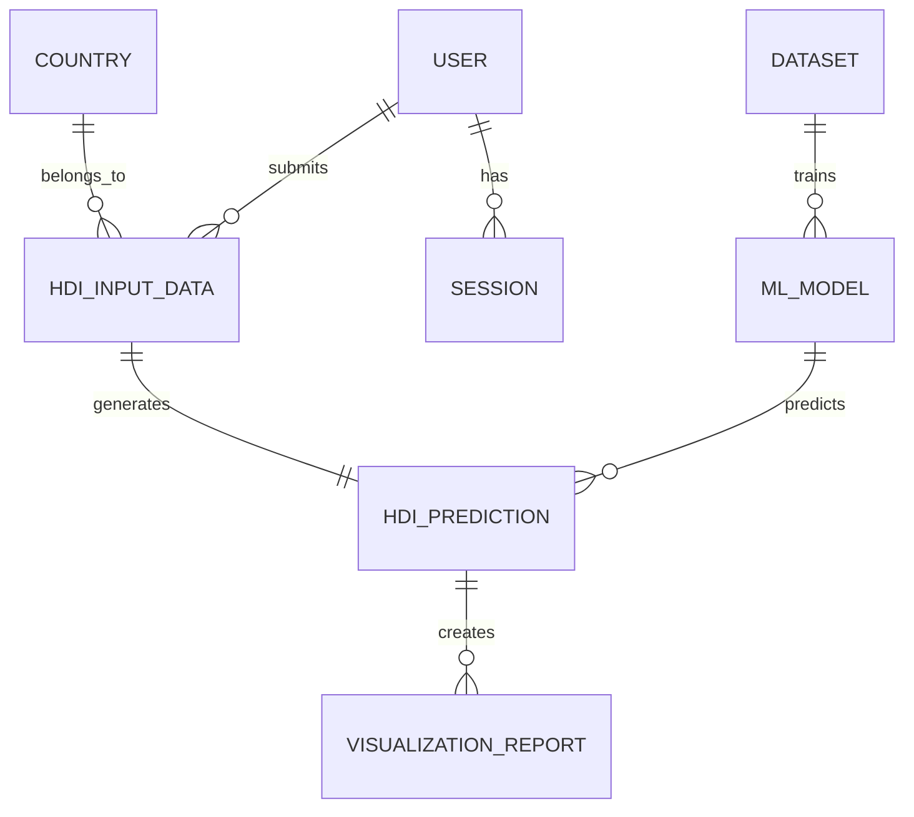

# HDI Prediction System

## Overview

The HDI Prediction System is a Machine Learning project that predicts the Human Development Index (HDI) of a country using socioeconomic indicators such as life expectancy, education index, and income index.

## Features

- User Management
- Country-wise HDI Prediction
- Machine Learning Model
- Prediction Reports
- Data Visualization
- Dataset Management

## Technologies Used

- Python
- Pandas
- NumPy
- Scikit-learn
- Flask
- HTML
- CSS
- JavaScript
- MySQL

## ER Diagram



## Project Structure

```
HDI-Prediction-System/
│
├── README.md
├── dataset/
├── models/
├── notebooks/
├── src/
├── static/
├── templates/
├── reports/
└── requirements.txt
```

## Future Improvements

- Deep Learning Models
- Real-Time Prediction
- Interactive Dashboard
- Cloud Deployment

## Author

Balaji
